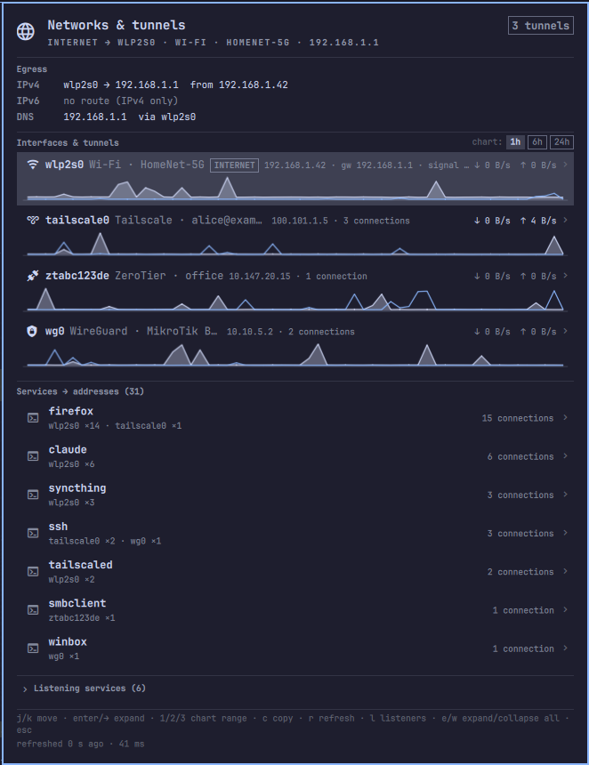
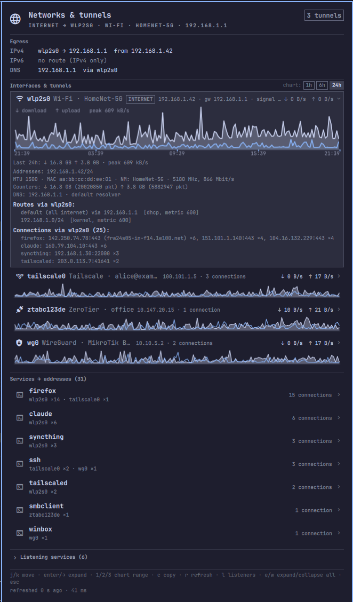
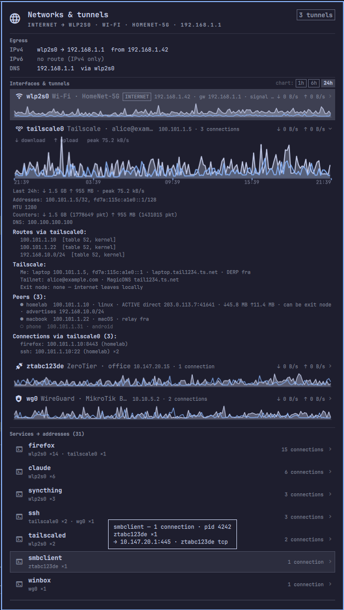
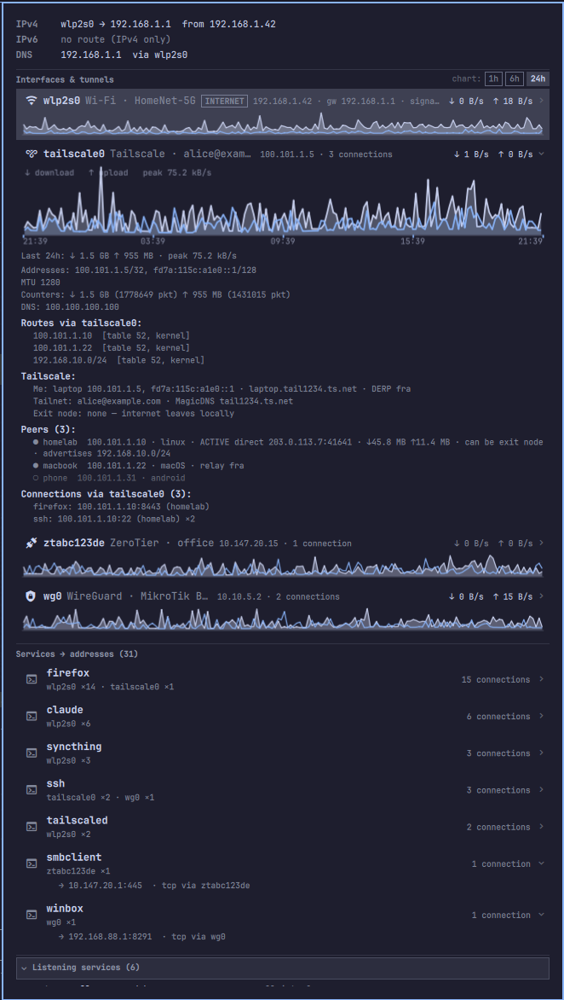
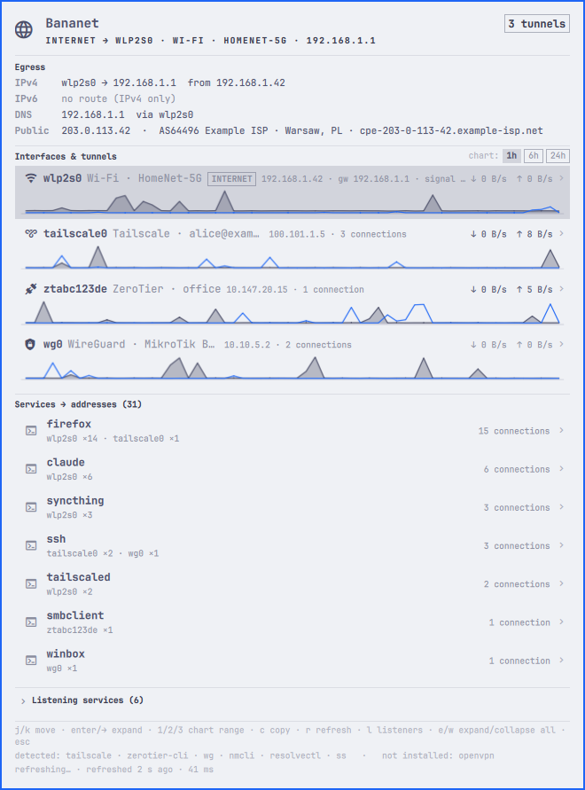

# Bananet — networks, tunnels & egress in the Omarchy bar

**Where does your traffic go?** An [Omarchy](https://omarchy.org) bar widget
that shows **where this machine's traffic really exits**: active networks and tunnels (Wi‑Fi, Ethernet,
Tailscale, ZeroTier, WireGuard / MikroTik Back To Home, OpenVPN), **your
public IP and who owns it**, live throughput with 24 h charts, routes, DNS,
and **which services (processes) talk to which addresses over which tunnel**.
No root required; the widget detects what is installed and only uses that,
degrades gracefully, and tells you what one command would unlock.

<p align="center">
  
  
</p>

## Install

```bash
omarchy plugin add https://github.com/blazejkapala/omarchy-bananet.git --enable
omarchy bar move banan.bananet --before omarchy.tailscale   # optional placement
```

Requirements: Omarchy 4.x (Quickshell bar), `python3`, `iproute2`, `nmcli`,
`resolvectl`, `ss`. Optional: `tailscale`, `zerotier-cli`, `wg`, `wl-copy`.
Set `demo` to `true` in the widget settings to see it with synthetic data.

## What you see

**In the bar:** a banana icon drawn in the theme colour. `iconStyle` switches
it to `emoji` (🍌) or `globe` (󰖟 when the internet leaves locally, 󰖂 when it
leaves through a tunnel). No label and no hover tooltip by default; `showLabel`
adds `wifi +2` (internet over Wi‑Fi, two tunnels up, or `exit:<name>` when a
Tailscale exit node is active) and `showTooltip` adds a hover summary (default
route, interfaces with rates, DNS, top services).

**Panel (left click):** opens as tall as the screen allows and only scrolls
when the content does not fit.

<p align="center">
  
  
</p>

Colours follow the active Omarchy theme, light or dark:

<p align="center">
  
</p>

- *Egress* — IPv4/IPv6 default route (honours policy routing, so a Tailscale
  exit node or a ZeroTier `allowDefault` show up truthfully), current DNS
  resolver, **public IP** (IPv4 / IPv6) with the owning network, city and
  country, warnings. The public address is checked every 5 minutes, when the
  egress route changes, and on manual refresh (`r`); a failed check keeps the
  last answer marked *stale* instead of pretending.
- *Interfaces & tunnels* — one row per interface: kind, network/tailnet name,
  IP, gateway, Wi‑Fi signal, connection count, a sparkline and live ↓/↑ rates.
  Hover = tooltip with details; click/Enter = expand: **traffic chart over
  time** (download as a filled area, upload as a line, time axis, peak and
  bytes moved in the range; range 1h / 6h / 24h via the pills in the section
  header or keys `1`/`2`/`3`), addresses, MTU, counters, DNS, **every route
  through that interface** (with routing tables), and for tunnels:
  - Tailscale: tailnet, MagicDNS, exit node, peer list (online/offline, direct
    or via DERP relay, bytes ↓/↑, advertised subnets),
  - ZeroTier: network (id, status, `managed/global/default` flags), managed
    routes, LEAF peers with latency and path (direct / relay),
  - WireGuard: peers, endpoint, allowed IPs, last handshake, bytes,
  - OpenVPN: config name and remote server,
  - plus **connections going through this interface grouped by process**.
- *Services → addresses* — every process with its connection count and split
  per interface (`wlp2s0 ×7 · tailscale0 ×2`). Expanding lists every remote
  address with port, protocol, interface and host name (reverse DNS, cached;
  Tailscale peers get their tailnet name).
- *Listening services* — ports something listens on and on which addresses
  (all / localhost only / a specific tunnel).
- *Optional privileges* — cards for permissions that improve the data (see
  below).

## Keyboard and mouse

| Action | Key / mouse |
|---|---|
| Open the panel | left click on the icon |
| Refresh | right click on the icon, `r` in the panel |
| Move | `j`/`k`, arrows |
| Expand / collapse a row | Enter, Space, `→`/`←`, click |
| Expand / collapse everything | `e` / `w` |
| Chart range 1h / 6h / 24h | `1` / `2` / `3` |
| Show listening services | `l` or click the header |
| Copy (interface IP / first remote address / listener address) | `c`, right click on a row |
| Close | Esc |
| Switch to a neighbouring bar panel | Tab / Shift+Tab |

## Settings (`~/.config/omarchy/shell.json`, the `banan.bananet` entry)

| Key | Default | Meaning |
|---|---|---|
| `refreshIntervalSec` | 10 | refresh interval while the panel is closed |
| `openRefreshIntervalSec` | 2 | refresh interval while the panel is open |
| `iconStyle` | `banana` | bar icon: `banana`, `emoji`, `globe` |
| `showLabel` | false | `wifi +2` label next to the icon |
| `showTooltip` | false | summary tooltip on hover |
| `publicIp` | true | check the public IP and its owner (icanhazip.com + ipinfo.io), see *Privacy* |
| `resolveNames` | true | reverse DNS for remote addresses (cached in `~/.cache/omarchy-bananet/`) |
| `useSudo` | true | try `sudo -n` for `wg`, `zerotier-cli`, `ss` (passwordless only; answer remembered 10 min) |
| `showInactive` | true | list interfaces that are down (e.g. Ethernet without a cable) |
| `showVirtual` | false | list bridges/veth (Docker etc.) |
| `showLoopback` | false | count connections to localhost |
| `demo` | false | synthetic data instead of the real system (screenshots, trying it out) |
| `labels` | `{}` | custom names, e.g. `{"wg0": "MikroTik BTH home"}` |

Example: `omarchy bar set banan.bananet labels '{"wg0":"MikroTik BTH"}' --json`

## Privileges — what works without root and what needs one step

The collector first detects what is installed (`tailscale`, `zerotier-cli`,
`wg`, `openvpn`, `nmcli`, `resolvectl`, `ss`) and only uses those tools; the
panel footer lists what it found. Nothing is suggested for a tool that is not
there, so a machine without WireGuard never sees a WireGuard setup card.

Everything basic (interfaces, routes, counters, DNS, Tailscale, connections
of your own processes) works without root. Three things need a one-time setup.
**The panel shows them itself**: a red card appears under the interface it
concerns (e.g. ZeroTier) with the command. Left click opens a terminal and
runs it (sudo asks for the password there), right click copies it. Less
important ones (`ss` for root process names) live in the *Optional
privileges* section. The same commands for manual use:

1. **ZeroTier** (`zerotier-cli` wants its auth token):
   ```bash
   sudo cp /var/lib/zerotier-one/authtoken.secret ~/.zeroTierOneAuthToken
   sudo chown $USER ~/.zeroTierOneAuthToken && chmod 600 ~/.zeroTierOneAuthToken
   ```
2. **WireGuard peers and handshakes** (`wg show` needs CAP_NET_ADMIN). Without
   it the widget still shows the interface, addresses, routes and counters, and
   takes peers from NetworkManager if the tunnel is configured there. For full
   data:
   ```bash
   echo "$USER ALL=(root) NOPASSWD: /usr/bin/wg show *" | sudo tee /etc/sudoers.d/omarchy-bananet-wg
   ```
3. **Root process names** (`tailscaled`, `zerotier-one`, `sshd`…). `ss -p`
   without root does not show other users' processes; the widget guesses them
   from ports and remote names (41641 / derp*.tailscale.com → tailscaled,
   9993 → zerotier-one, 22 → ssh) and marks them "name guessed from port".
   Full data:
   ```bash
   echo "$USER ALL=(root) NOPASSWD: /usr/bin/ss" | sudo tee /etc/sudoers.d/omarchy-bananet-ss
   ```

## Traffic history

The collector stores every interface's byte counters every 30 s in
`~/.cache/omarchy-bananet/history.jsonl` and keeps 24 h. It only records while
the bar runs (after suspend/logout the chart shows a gap, not a fake spike).
Charts show average rates per bucket for the selected range, and the total
under the chart is the real number of bytes moved in that range. Delete the
file to reset the history.

What **cannot** be shown without extra tools: how many bytes a specific
process sent through a specific tunnel. The kernel counts bytes per interface,
not per process; that needs `nethogs`/eBPF. The widget shows per-interface
rates and counters, and per process the list of connections and what they go
through.

## Files

- `manifest.json` — plugin manifest (`bar-widget`)
- `Panel.qml` — bar icon, tooltip, panel and charts
- `BananaIcon.qml` — the banana icon drawn on a Canvas
- `collect.py` — collector: `ip -j`, `/proc/net/dev`, `nmcli`, `resolvectl`,
  `tailscale status --json`, `zerotier-cli -j`, `wg show all dump`, `ss -tunp`.
  Run it by hand: `python3 collect.py --history | jq .`

## Manage

The plugin lives in `~/.config/omarchy/plugins/banan.bananet/` and reloads on
every file save. If a change does not seem to apply, run `omarchy restart shell`.

```bash
omarchy plugin enable banan.bananet
omarchy plugin disable banan.bananet      # hide it
omarchy plugin update banan.bananet       # pull a new version
omarchy plugin remove banan.bananet
omarchy-shell banan.bananet toggle        # open/close the panel from a keybinding
omarchy-shell banan.bananet refresh
```

## Privacy

Everything runs locally except two optional lookups:

- **Public IP** (`publicIp`, on by default): `https://ipv4.icanhazip.com` and
  `https://ipv6.icanhazip.com` return the address, then `https://ipinfo.io/<ip>/json`
  tells who owns it (organisation, city, country). This happens at most every
  5 minutes, when the egress route changes, or on manual refresh, never on every
  tick; the answer is cached in `~/.cache/omarchy-bananet/public.json`. Set
  `publicIp` to `false` to never contact these services.
- **Reverse DNS** for remote addresses (`resolveNames`), which goes through
  your normal resolver.

The screenshots above were taken in demo mode with synthetic data.

## License

MIT
